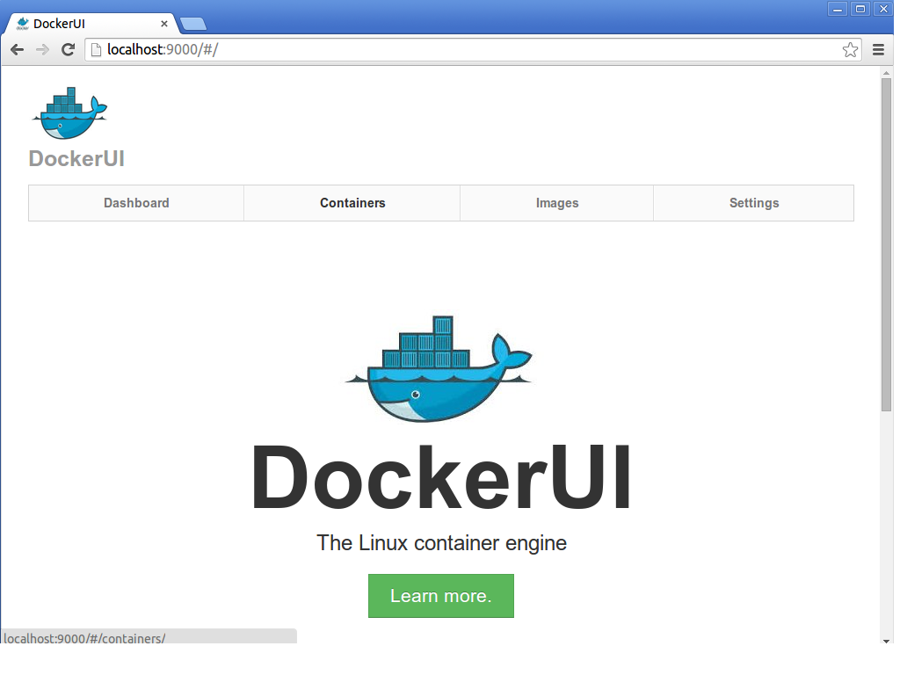
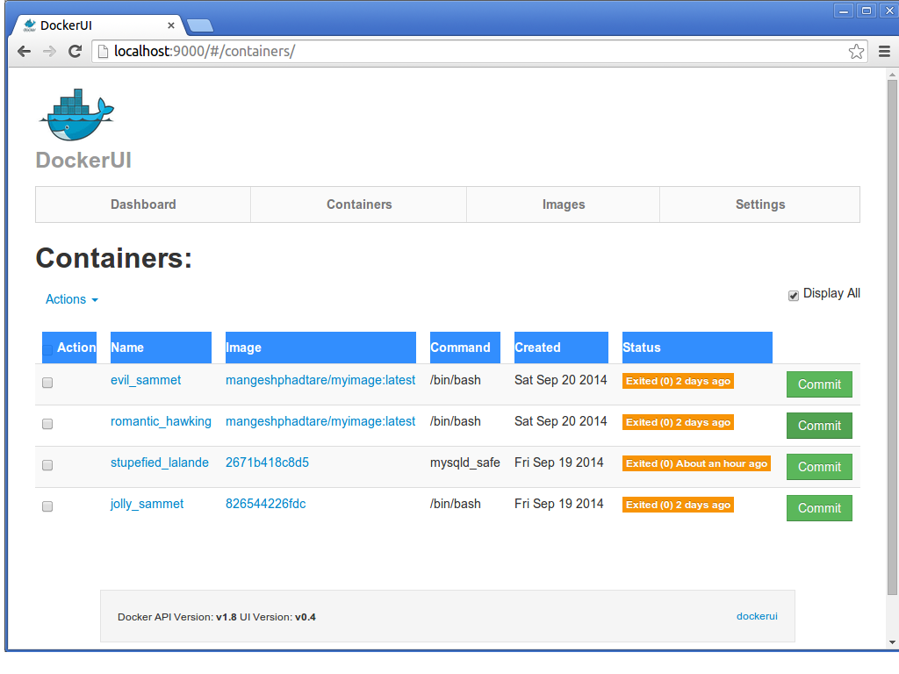
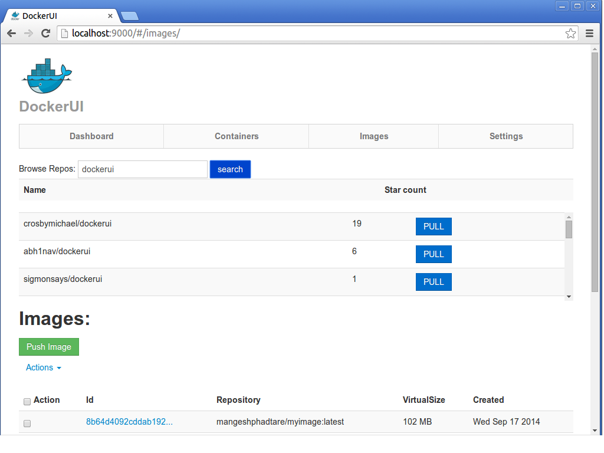
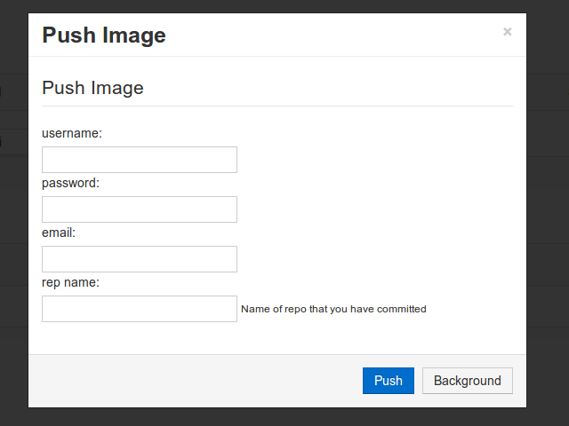
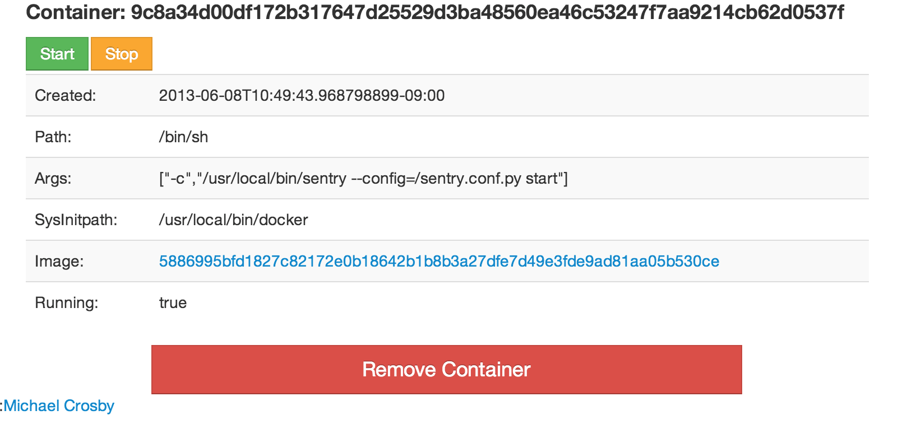
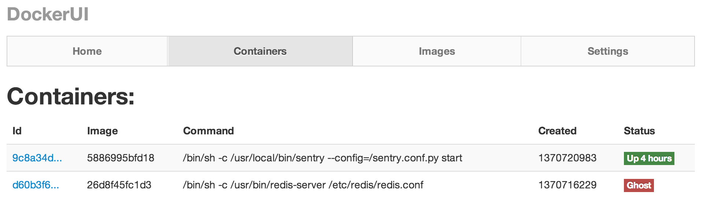

## DockerUI

```
DockerUI is a web interface to interact with the Remote API.  
The goal is to provide a pure client side implementation so it is effortless to connect and manage 
docker.This project is not complete and is still under heavy development.
```

### New Functionality added
```
#* Search repositories from docker hub
#* Pull repositories from docker hub
#* commit container
#* Push files to a docker hub
```


### Quickstart 

#### Step 1

Configure CORS Request :

To enable cross origin requests to the remote api add the flag "–api-enable-cors" when running docker in daemon mode.

```
vim /etc/default/docker

Copy paste below line to /etc/default/docker at end

DOCKER_OPTS="-H unix:///var/run/docker.sock -H tcp://0.0.0.0:4243 -api-enable-cors"

Restart the Docker Service 

/etc/default#service docker.io start
```


#### Step 2
  
Pull the latest image:  
  
```
docker pull madhavkobal/dockerui:latest
```
  
#### Step 3
If you're running Docker using a unix socket (default):  
  
```
docker run -d -p 9999:9999 -v /var/run/docker.sock:/docker.sock \
--name dockerui madhavkobal/dockerui:latest -e="/docker.sock"
```
  
If you're running Docker over tcp:  
  
```
docker run -d -p 9999:9999 --name dockerui \
madhavkobal/dockerui:latest -e="http://<docker_host_ip>:4243"
```
  
#### Step 4
```
Open your browser to `http://localhost:9999`  
Or
Open your browser to `http://<dockerd host ip>:9999`  

If you're running Docker using go server: 

Extract your downloaded zip file dockerui-master.
Run go server using :
 go run dockerui.go
 Open your browser to `http://localhost:9999` 
```  
  
#### Warning
Bind mounting the unix socket into the DockerUI container is much more secure than exposing your docker 
daemon over TCP. You should still secure your DockerUI instance behind some type of auth.  Maybe running 
Nginx infront of DockerUI with basic auth.  
  
### Screenshots













### Goals
* Little to no dependencies - I really want to keep this project a pure html/js app.  I know this will have to change so that I can introduce authentication and authorization along with managing multiple docker endpoints. 
* Consistency - The web UI should be consistent with the commands found on the docker CLI.

### Stack
* Angular.js
* Flatstrap ( Flat Twitter Bootstrap )
* Spin.js
* Ace editor


### License - MIT
The DockerUI code is licensed under the MIT license. Flatstrap (bootstrap) is licensed under the Apache License v2.0 and Angular.js is licensed under MIT.

**DockerUI:**
Copyright (c) 2013 Michael Crosby. http://crosbymichael.com  
  
Update credits:  
madhav@os3infotech.com
sharvari.limbkar@os3infotech.com
sayalee.hande@os3infotech.com
mangesh.phadtare@os3infotech.com
  
Permission is hereby granted, free of charge, to any person
obtaining a copy of this software and associated documentation 
files (the "Software"), to deal in the Software without 
restriction, including without limitation the rights to use, copy, 
modify, merge, publish, distribute, sublicense, and/or sell copies 
of the Software, and to permit persons to whom the Software is 
furnished to do so, subject to the following conditions:
  
The above copyright notice and this permission notice shall be 
included in all copies or substantial portions of the Software.
  
THE SOFTWARE IS PROVIDED "AS IS", WITHOUT WARRANTY OF ANY KIND,
EXPRESS OR IMPLIED,
INCLUDING BUT NOT LIMITED TO THE WARRANTIES OF MERCHANTABILITY, 
FITNESS FOR A PARTICULAR PURPOSE AND NONINFRINGEMENT. 
IN NO EVENT SHALL THE AUTHORS OR COPYRIGHT 
HOLDERS BE LIABLE FOR ANY CLAIM, 
DAMAGES OR OTHER LIABILITY, 
WHETHER IN AN ACTION OF CONTRACT, 
TORT OR OTHERWISE, 
ARISING FROM, OUT OF OR IN CONNECTION WITH 
THE SOFTWARE OR THE USE OR OTHER DEALINGS IN THE SOFTWARE.
